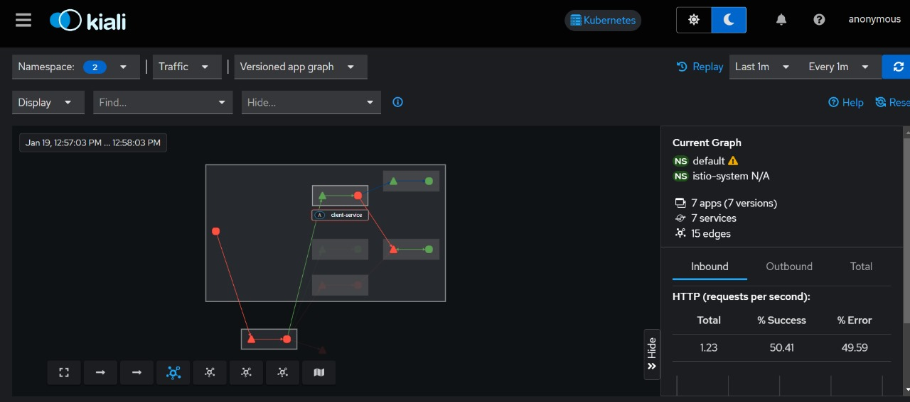
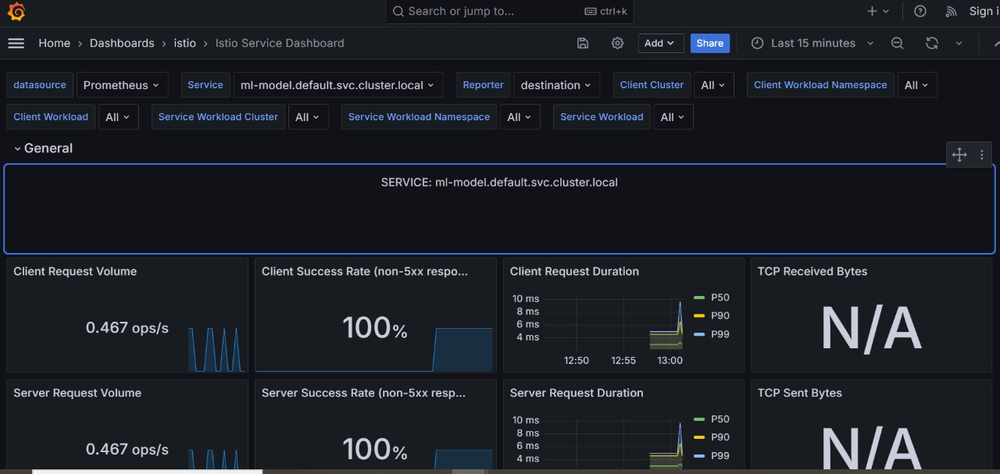
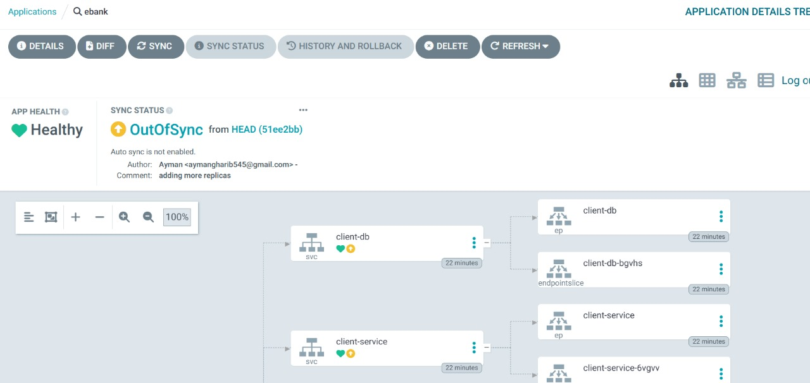
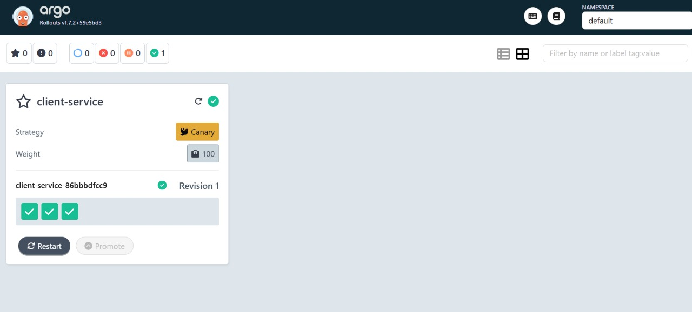
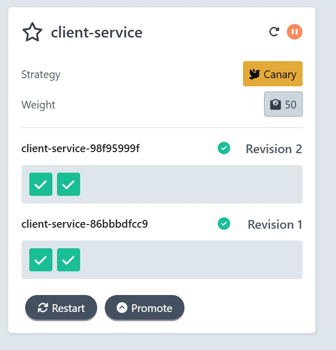
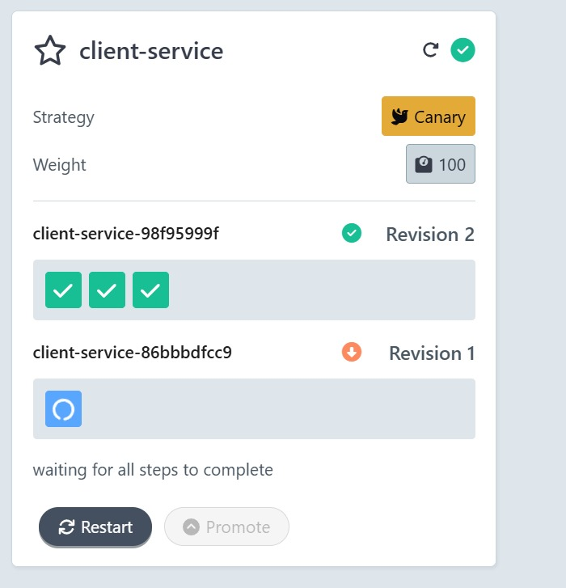
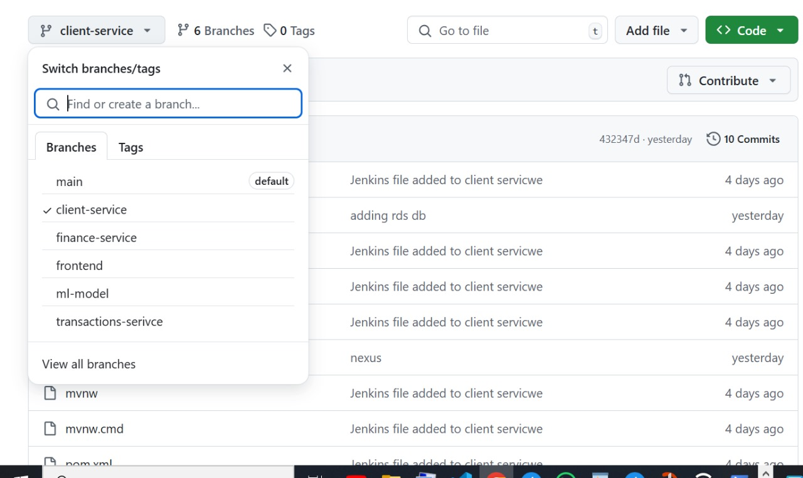
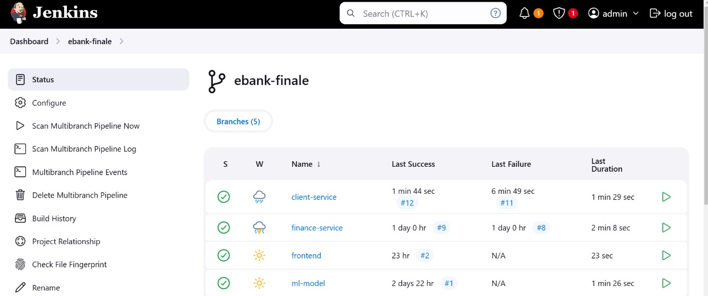
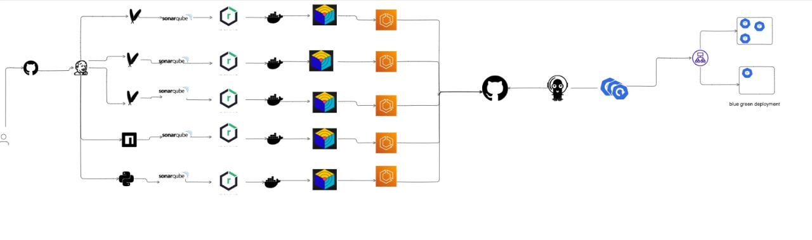
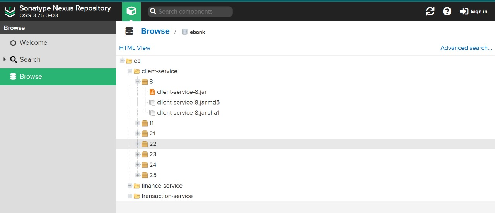

# Setting up the cluster && configuring the CD 
###  please clone the v1 of the project where you'll find the dockerfiles 

 ```bash
git clone https://github.com/FinTech-LSI2/e-bank.git
git checkout -b origin/ayman
```

###  step  1 : dockerize the project

in such folder you would find the Dockerfile for its respective service run this cmd to run the project 

 ```bash
docker-compose up -d
```
### step 2 : installing a k8s cluster manually using Kind  
per example if youre using powershell use scoop as package manager 

 ```bash
scoop install kind 
 kind create cluster --config kind.yaml --name ebank
```

### step 3 :  k8s manifest files 
in these step , i created a svc and a deployement for each microservice 
and exposing the frontend just as nodeport 

 ```bash
kubectl apply -f ./k8s
```

### if you want use helm 
 ```bash
 helm install ebank-helm ./my-helm-app

 
```

### upgreade the app
 ```bash
helm upgrade my-app ./my-helm-app \
        --set client.image.tag=${BUILD_NUMBER}
```

### step 4 :  using istio as a service mesh to manage the cluster 


Istio is a powerful service mesh platform that simplifies service-to-service communication in microservices architectures. It provides advanced capabilities like traffic management, service discovery, security, and observability without requiring changes to application code.


### steps to install istio
first of all you need to install istioctl (you can use helm bu its not supported anymore by istio)
 ```bash
curl -L https://istio.io/downloadIstio | sh -
```
### install istio to your clluster using istioctl 
 ```bash
istioctl install --set profile=demo -y
```
this cmd will automaticly create the istio controle plane and also an ingress gateway im just going to use it to connect the frontend to my backend not externaly  

### install addons like grafana kiali and prometheus

 ```bash
kubectl apply -f istio\istio-1.24.2\samples\addons -n istio-system
```
### label the ns to inject the sidecars 
 ```bash
kubectl label namespace default istio-injection=enabled
```

### stimulate the trrafic  (use the ip addresse of the istio gateway or just the name of the service )
 ```bash

 kubectl exec -it <frontend pod >
while true; do
    echo "Running curl for productpage:"
    curl 10.100.89.59/
    curl 10.100.89.59/api/client/clients
    curl 10.100.89.59/api/finance/devise
     curl 10.100.89.59/api/transactions/clients/1
    sleep 2
done 
```
## use kiali and grafana to visualize the trafic 
## kiali : 

## grafana : 


## next step link the  cluster with argocd to apply gitops 
GitOps is a modern operational framework that uses Git as the single source of truth for declarative infrastructure and application management. With GitOps, all configuration and deployment changes are managed through Git repositories, providing a clear version history, easy rollbacks, and improved collaboration.


### steps to configure argocd : 
 ```bash
kubectl create namespace argocd
kubectl apply -n argocd -f https://raw.githubusercontent.com/argoproj/argo-cd/stable/manifests/install.yaml
kubectl apply -f svc.yaml 
```
### username : admin
 
### password :
 ```bash
 kubectl get secret argocd-initial-admin-secret -n argocd -o jsonpath="{.data.password}" | % {[System.Text.Encoding]::UTF8.GetString([System.Convert]::FromBase64String($_))}
```

### use the nodeport to access to the ui , bring the token from your github and create a reposotory in argocd and create an application from it 



### blue green deployement using argorollout
Blue-green deployment is a release strategy that minimizes downtime and risk by maintaining two separate environments: one for the current version (blue) and another for the new version (green). Argo Rollouts enhances Kubernetes with advanced deployment strategies like blue-green, allowing seamless switching between these environments. Using Argo Rollouts, you can manage the transition from blue to green environments with fine-grained control, monitor metrics during the rollout, and instantly rollback if needed. This approach ensures smooth updates while maintaining service availability and providing a safety net for production deployments
### in these step i changed the deployement to rollouts 


###  configure argo rollouts 

 ```bash
kubectl create namespace argo-rollouts
kubectl apply -n argo-rollouts -f https://github.com/argoproj/argo-rollouts/releases/latest/download/install.yaml
```

### Install argo rollouts plugin for kubectl

 ```bash
brew install argoproj/tap/kubectl-argo-rollouts
 ```

### rollout example 
```bash
kubectl apply -f client-deploy.yaml
```
### using the argo rollout dashbord to visualise
```bash
kubectl argo rollouts dashboard
```





### if the manifest files dont work as wanted please clone the argocd repo because it has the latest version of the files 
```bash
git clone https://github.com/FinTech-LSI2/ARGOCD_EBANK.git
```

# Continious Integrtion : 
### first of all create a github repo compatible with jenkins multibaranch pipeline 
### each service is a branch and it should contain a jenkins file like this :



### now creating a webhook (go the repo setting webhooks ) :

```bash
http://<jenkins_url>:8080/multibranch-webhook-trigger/invoke?token=<token_name>   
```

### i got the token when i created the multibranch pipline in jenkins 

###  the jobs will be created automaticly afterwards 



###  pipeline overview




## it goes like this 

#### dev push the code -> triggers the webhook --> build and test the project using maven -->
 #### scan the code using sonarqube --> store the artifact in nexus --> build the docker image -->
 #### scan the image using trivy --> push the image to ecr --> change the image name to the #### argocd repo --> argocd synchronize the changes in the k8s cluster


 ## some results : 

 ## soanar

 ## nexus

